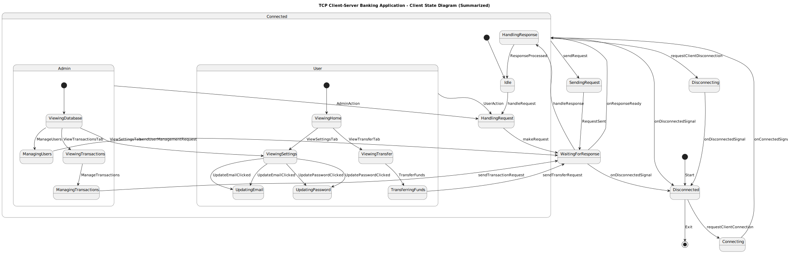
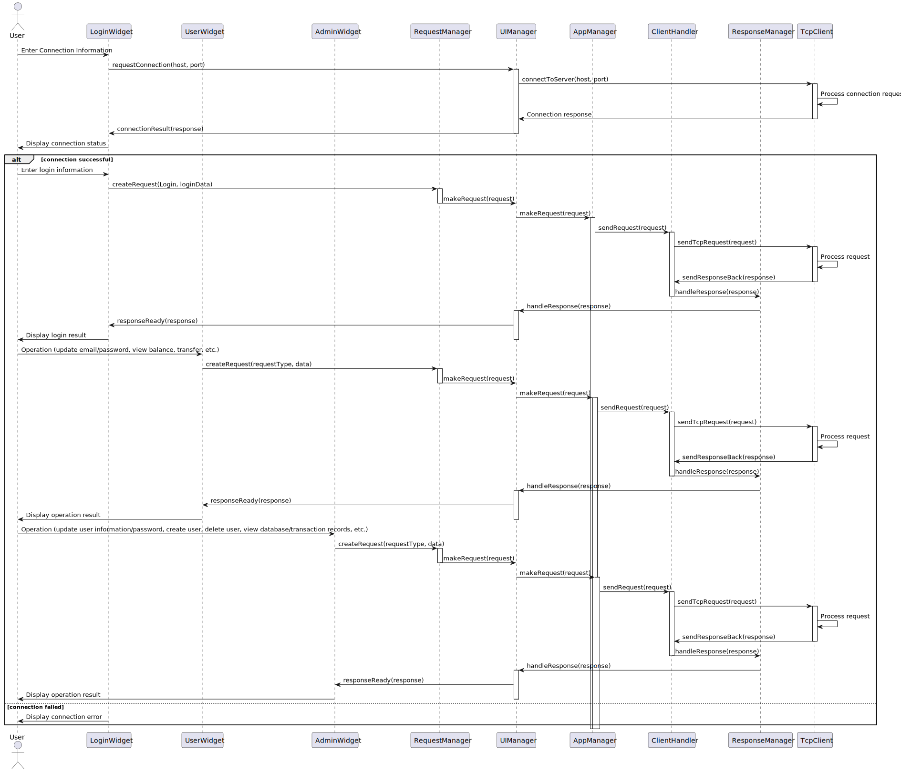

# QT-Banking-System-Client

## Overview

QT-Banking-System-Client is the client-side implementation of a banking system, built using the Qt 6/C++ framework. The application provides a graphical user interface (GUI) for users and administrators to manage bank accounts, process transactions, and handle various banking operations.

The client communicates with a server-side application through a TCP socket and handles database operations using PostgreSQL (in the server side) with Supabase hosting.

<!-- link for Client-Server project -->
> [!NOTE]
> This project is part of a Banking System (TCP Client-Server) project, which includes the following repositories:
> - [QT-Banking-System-Client](https://github.com/7osssam/QT-Banking-System-Client): The client-side implementation of the banking system.
> - [QT-Banking-System-Server](https://github.com/7osssam/QT-Banking-System-Server): The server-side implementation of the banking system.

## Features

- **User Management:** Administrators can manage user accounts, including creating, updating, and deleting accounts.
- **Transaction Management:** Users can view transaction history and process transactions securely.
- **Real-Time Updates:** The client receives real-time updates from the server regarding account balances and transaction statuses.
- **Secure Communication:** Communication between the client and server is secured with appropriate security measures (e.g., hashing, encryption).
- **Responsive UI:** The application features a responsive and user-friendly interface, utilizing Qt's powerful GUI capabilities with the help of [qt-material-widgets](https://github.com/sebcaux/qt-material-widgets) library for a modern look and feel.

## Technologies Used

- **C++/Qt 6:** Core language and framework for building the application.
	- **Qt Components:** Gui, Widgets, Network and StateMachine modules.
- **JSON:** Data format for communication between client and server.
- **CMake:** Build system for managing the build process.
- **GoogleTest:** Framework for unit testing the application.
- **GitHub Actions:** Continuous integration for automated testing and documentation generation.
- **Doxygen:** Tool for generating documentation from source code.

## Setup and Installation

### Prerequisites

- Qt 6.7.1 or later
- CMake
- MinGW or another compatible compiler

### Building the Project (Using the wrapper Makefile)

1. Clone the repository:
```sh
git clone https://github.com/7osssam/QT-Banking-System-Client.git
cd QT-Banking-System-Client
```

2. Install dependencies:
```sh
make dependency
```

3. Configure the project using CMake:
```sh
make clean-cache-reconfigure
```

4. Build the project using the Makefile:
```sh
make build
```

### Running the Application

To run the application, execute the following command:
```sh
make run
```
## Usage

### User Interface

The client application provides the following main UI components:

- **Login Form:** Allows users to log in to their accounts.
<!-- gif of login form -->
- **Admin Dashboard:** Provides administrators with tools for managing users and viewing transaction logs.
<!-- gif of admin dashboard -->
- **User Dashboard:** Allows users to view their account details and transaction history.
<!-- gif of user dashboard -->

### Signals and Slots

Qt's signal and slot mechanism is used extensively throughout the application to handle UI interactions and communicate with the server.

## Testing

Unit tests are written using GoogleTest. To build and run the tests, execute the following command:
```sh
make test
```

## Documentation

Comprehensive documentation is available, detailing the purpose, design, and usage of each class and function within the project. The documentation is generated using Doxygen and can be viewed by opening the `docs/html/index.html` file in a web browser or by visiting the [GitHub Page](https://7osssam.github.io/QT-Banking-System-Client/) site.

<!-- OOP design Diagrams (Class Diagrams, Sequence Diagrams, State Diagrams, Include Diagrams) -->
## Design and Architecture
### Include Diagram

### State Diagram

### Sequence Diagram



## Continuous Integration

The project uses GitHub Actions for continuous integration. The build and test status can be monitored through the following badges:

| Documentation | Pages Build Deployment | Ubuntu CI Test |
|---------------|------------------------|----------------|
| [](https://github.com/7osssam/QT-Banking-System-Client/actions/workflows/documentation.yml) | [](https://github.com/7osssam/QT-Banking-System-Client/actions/workflows/pages/pages-build-deployment) | [](https://github.com/7osssam/QT-Banking-System-Client/actions/workflows/Ubuntu.yml) |

## Contribution

Contributions are welcome! Please open an issue or submit a pull request for any changes or enhancements.

## License

This project is licensed under the MIT License. See the LICENSE file for details.

---

Happy coding!
